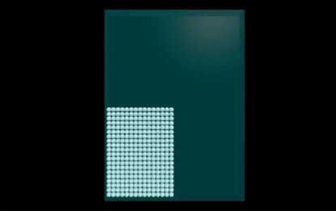

# 💦 VPython을 이용한 SPH 시뮬레이션

VPython을 사용하여 구현한 **Smoothed Particle Hydrodynamics (SPH) 시뮬레이션**입니다.  
입자 기반 유체 시뮬레이션을 통해 **압력, 점성, 중력** 등을 고려한 물리적 움직임을 표현합니다.

## 🎥 시뮬레이션 미리보기



 
## 🚀 주요 기능

- 🔵 **실시간 유체 시뮬레이션** (Smoothed Particle Hydrodynamics)
- 🌊 **입자 기반 물리 엔진** (압력, 점성, 외력 적용)
- 🎥 **프레임 캡처 기능** (이미지를 저장하여 동영상 생성 가능)
- 🖥️ **VPython을 이용한 3D 시각화**

---

## 🛠️ 설치 방법

### 🔹 **1. Git 저장소 클론**
```bash
git clone https://github.com/your-username/sph-vpython.git
cd sph-vpython
```

## 🔖 My Blog..!
https://tithingbygame.tistory.com/
